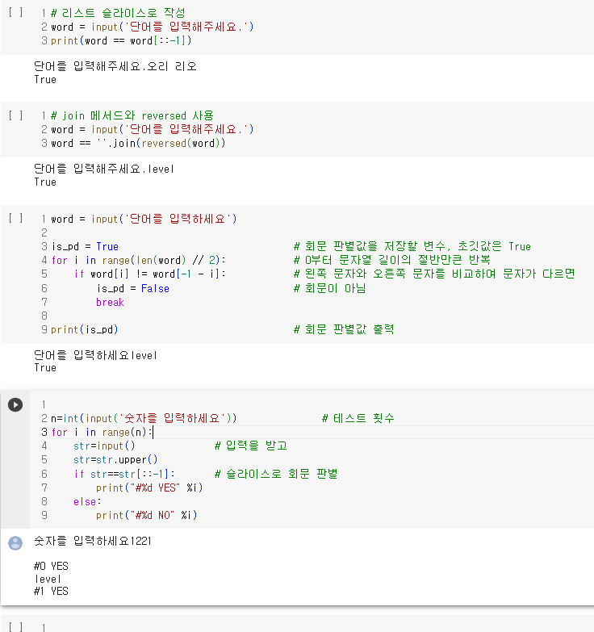

# AIFFEL Campus Online Code Peer Review Templete
- 코더 : 정인호
- 리뷰어 : 김영진

# PRT(Peer Review Template)
- [ X ]  **1. 주어진 문제를 해결하는 완성된 코드가 제출되었나요?**
   

- [ X ]  **2. 전체 코드에서 가장 핵심적이거나 가장 복잡하고 이해하기 어려운 부분에 작성된
주석 또는 doc string을 보고 해당 코드가 잘 이해되었나요?**

- [ X ]  **3. 에러가 난 부분을 디버깅하여 문제를 “해결한 기록을 남겼거나”
”새로운 시도 또는 추가 실험을 수행”해봤나요?**
       
- [ X ]  **4. 회고를 잘 작성했나요?**
       
- [ ]  **5. 코드가 간결하고 효율적인가요?**
    코드를 함수로 만드시지는 않았다.  
    여러 개의 코드를 만들어서 기능이 각각 따로 되는 면이 있었다.  
    그래서 코드가 약간 복잡한 것 같다.

'''
# 리스트 슬라이스로 작성
word = input('단어를 입력해주세요.')
print(word == word[::-1])
'''

'''
# join 메서드와 reversed 사용
word = input('단어를 입력해주세요.')
word == ''.join(reversed(word))
'''

'''
word = input('단어를 입력하세요')

is_pd = True                               # 회문 판별값을 저장할 변수, 초깃값은 True
for i in range(len(word) // 2):            # 0부터 문자열 길이의 절반만큰 반복
    if word[i] != word[-1 - i]:            # 왼쪽 문자와 오른쪽 문자를 비교하여 문자가 다르면
        is_pd = False                      # 회문이 아님
        break

print(is_pd)                               # 회문 판별값 출력
'''

'''

n=int(input('숫자를 입력하세요'))               # 테스트 횟수
for i in range(n):
    str=input()              # 입력을 받고
    str=str.upper()
    if str==str[::-1]:       # 슬라이스로 회문 판별
        print("#%d YES" %i)
    else:
        print("#%d NO" %i)
'''